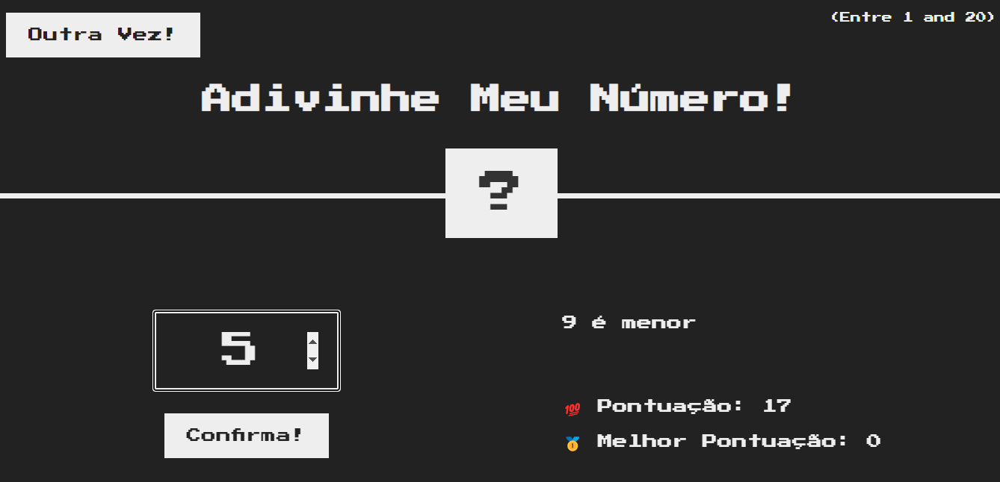

## Projeto de um Jogo para adivinhar o numero de 1 a 20

**Projeto feito passo a passo**

- HML e CSS, pronto, modificado alguns detalhes para ajuste de fonte e tela para o portugues

**Criação Personalizada**

- O javascript (vanilla) feito somente com o descrito do desafio sem passo a passo, apenas consultas em aulas anteriores e material de anotações
