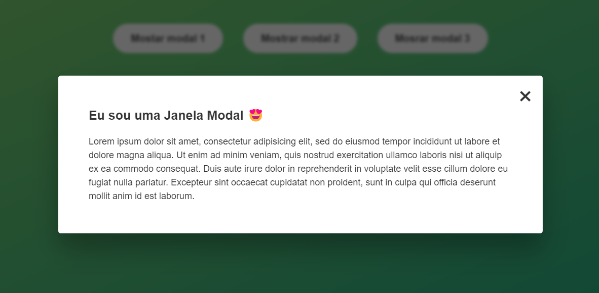

## Projeto de uma janela com 3 Modals fullscreen clicando fora também sai

**Projeto feito passo a passo**

- HML e CSS, pronto, modificado alguns detalhes de texto 

**Criação Personalizada**

- O javascript (vanilla) feito somente com o descrito do desafio sem passo a passo, apenas consultas em aulas anteriores e material de anotações.
